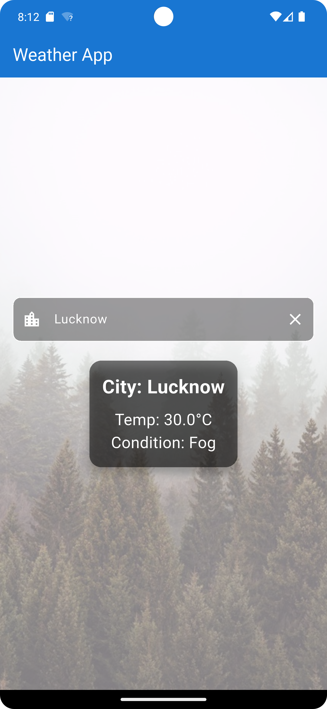
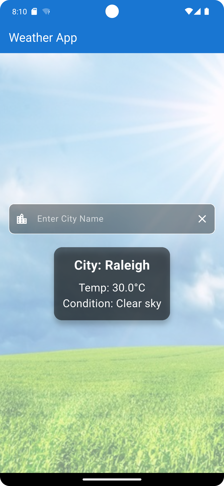

[# Weather App with Weatherbit API

## Project Description
This Flutter project is a mobile application that fetches and displays current weather conditions for a specified location using the Weatherbit Current Weather API. The app allows users to input a city name or use their device's location (via latitude and longitude) to retrieve real-time weather data, including temperature, humidity, wind speed, and weather descriptions. The app features a clean, user-friendly interface and handles API requests efficiently with error handling. This is a good small college project, ideal for learning Flutter and API integration.

## Screenshots
- **Foggy Day**: 
- **Sunny Day**: 

## Features
- Fetch current weather data by city name or coordinates.
- Display weather details such as temperature, humidity, wind speed, and weather description.
- Support for multiple unit systems (Metric, Imperial, Scientific).
- Responsive UI with a modern design.
- Error handling for invalid inputs or API failures.
- Location-based weather retrieval using device geolocation (optional).

## Prerequisites
- **Flutter SDK**: Version 3.0.0 or higher.
- **Dart**: Version 2.17.0 or higher.
- **Weatherbit API Key**: Obtain a free API key from [Weatherbit](https://www.weatherbit.io/account/create).
- **IDE**: Android Studio, VS Code, or any Flutter-supported IDE.
- **Dependencies**:
  - `http`: For making API requests.
  - `geolocator`: For accessing device location (optional).
  - `flutter_dotenv`: For managing API keys securely.

## Setup Instructions

1. **Clone the Repository**:
   ```bash
   git clone <repository-url>
   cd weather_app
   ```

2. **Install Dependencies**:
   Run the following command to install required packages:
   ```bash
   flutter pub get
   ```

3. **Configure Weatherbit API Key**:
   - Sign up for a free account at [Weatherbit](https://www.weatherbit.io/account/create).
   - After signing up, you’ll receive an API key via email or in your account dashboard.
   - Create a `.env` file in the project root directory and add your API key:
     ```env
     WEATHERBIT_API_KEY=your_api_key_here
     ```
   - Ensure the `.env` file is listed in `.gitignore` to prevent exposing your API key.

4. **Run the App**:
   - Connect a device or emulator.
   - Run the app using:
     ```bash
     flutter run
     ```

## Project Structure
```
weather_app/
├── lib/
│   ├── main.dart              # Entry point of the application
│   ├── models/
│   │   └── weather.dart       # Data model for weather data
│   ├── services/
│   │   └── weather_service.dart # API service to fetch weather data
│   ├── screens/
│   │   └── home_screen.dart   # Main screen for displaying weather
│   └── utils/
│       └── constants.dart      # Constants like API base URL
├── .env                       # Environment file for API key
├── pubspec.yaml               # Project dependencies
└── README.md                  # This file
```

## How to Use the Weatherbit API Free Trial
The Weatherbit API offers a free tier for developers to test and integrate weather data. Follow these steps to use the free trial:

1. **Sign Up**:
   - Visit [Weatherbit Account Creation](https://www.weatherbit.io/account/create).
   - Provide your email and create an account. No credit card is required for the free tier.

2. **Obtain API Key**:
   - After signing up, check your email or log in to your Weatherbit account to find your API key.
   - The free tier includes a limited number of API calls per day (typically 500 calls/day, but check the [Weatherbit Pricing](https://www.weatherbit.io/pricing) for exact limits).

3. **Make API Requests**:
   - Use the base URL: `https://api.weatherbit.io/v2.0/current`.
   - Required parameter: `key=your_api_key`.
   - Example request by city:
     ```
     https://api.weatherbit.io/v2.0/current?city=Raleigh,NC&key=your_api_key
     ```
   - Example request by coordinates:
     ```
     https://api.weatherbit.io/v2.0/current?lat=35.7796&lon=-78.6382&key=your_api_key
     ```
   - Optional parameters:
     - `units=M` (Metric), `S` (Scientific), or `I` (Fahrenheit).
     - `lang=en` (English) or other supported languages.
     - `include=minutely` (for minutely forecast, counts as additional request).

4. **Free Tier Limitations**:
   - Limited to a specific number of API calls per day.
   - Some features (e.g., batch requests, lightning data) require a paid subscription.
   - Data is not suitable for archiving; use the Historical Weather API for that purpose.

5. **API Documentation**:
   - Refer to the [Weatherbit API Documentation](https://www.weatherbit.io/api/weather-current) for detailed parameter descriptions and response formats.

## Usage
- Launch the app on your device or emulator.
- Enter a city name (e.g., "Raleigh,NC") or allow the app to use your location.
- View the current weather details, including temperature, humidity, and wind speed.
- Switch between unit systems (Metric/Imperial) in the app settings (if implemented).

## Notes
- The free Weatherbit API has a daily call limit, so monitor usage during development.
- Ensure proper error handling for network issues or invalid API keys.
- For production use, consider upgrading to a paid plan for higher quotas and additional features.

## Contributing
Contributions are welcome! Please fork the repository, create a feature branch, and submit a pull request with your changes.

## License
This project is licensed under the MIT License. See the [LICENSE](LICENSE) file for details.

## Contact
For questions or support, contact the project maintainer or reach out to Weatherbit support at [Weatherbit Contact](https://www.weatherbit.io/contact). Please connect with me if you need any help; WhatsApp: +91-9807070171.
](https://meet.google.com/yth-eudu-hmm)
